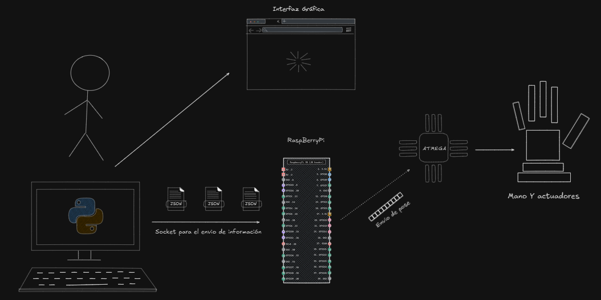
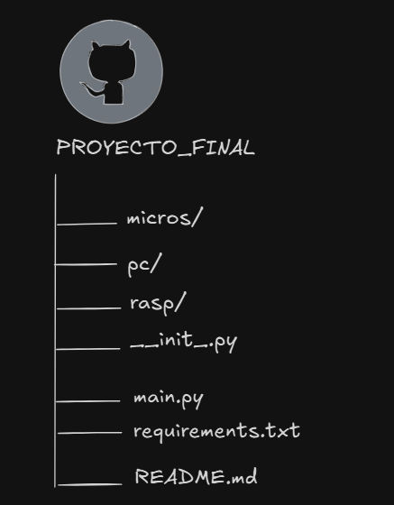

---
# Mano Robótica con MediaPipe
---

Control de una mano robótica de 6 servos mediante visión computacional.
Detecta gestos de la mano en tiempo real (piedra, papel, tijera y réplica de movimiento)

usando MediaPipe en la PC, transmite los comandos a una Raspberry Pi vía socket, la cual sirve como orquestador para que un ATmega328P pueda mover lo motores de cada parte de la mano (Dedos y muñeca)

---

## Arquitectura del sistema



---

## Estructura del proyecto
Los archivos estan divididos de la siguiente forma:


Donde cada nombre de la carpeta muestra donde se debe ejecutar el código y los archivos que contiene para dicha parte del proyecto.

---

## Crear entorno virtual e instalar dependencias

Para la creación del ambiente virtual estoy usando UV pero sientete libre de usar el manejador de paquetes de tu preferencia. Ya sea PIP, Anaconda o Micromamba c:

```bash
# Crea el entorno virtual con una versión de Python compatible
uv venv --python 3.11


# Activa el entorno
# Linux/Raspbian:
source .venv/bin/activate
# Windows:
.venv\Scripts\activate

# Instala todas las dependencias
uv pip install -r requirements.txt
```

Para otro manejador de paquetes famosos como PIP:

```bash 
# Con pip
python -m venv 

# Para activar (en windows)
.venv\Scripts\activate 
# Si no funciona prueba con:
.venv\Scripts\activate.ps1

# Para activar en Linux/Raspbian:
source .venv/bin/activate

# instalar dependencias
pip install -r requirements.txt


```

---

## Modos de operación

En esta versión existen dos modos de operación
- Modo Espejo = Recreara la pose de la mano que el usuario realice por medio de la camára 
- Modo PPT = Modo de juego donde el usuario jugara contra la mano para luego determinar al ganador

---

## Comunicación entre componentes

La comunicación entre los diferentes modulos del sistema se da mediante dos principales interfaces:
- Socket TPC para comunicacion entre la computadora (encargada de cuestiones más complejas como las de la visión computacional)

- protocolo UART para el envio de las poses/angulos que la mano debe realizar al microcontrolador 

### Conexiómn con la rasp

Se recomienda ejecutar el siguiente comando en la terminal para podere escanear la red y poder localizar la IP donde la Raspberry pi esta conectada.


'''bash 
1..254 | ForEach-Object {
>>     $ip = "172.20.10.$_"
>>     if (Test-Connection -ComputerName $ip -Count 1 -Quiet) {
>>         Write-Host "Dispositivo encontrado: $ip" -ForegroundColor Green
>>     }
>> }
'''
---

## Hardware

El Hardware consta de:
- RaspBerry Pi 5
- Microcontrolador ATMEGA328P 
- 6 Servo Motores de 2.2Kg de torque
    - 1 para la muñeca 
    - 1 para cada dedo de la mano 
  


---

## Escalabilidad del ATmega328P


El ATmega328P actúa como capa de actuadores desacoplada. Al concentrar el control
de periféricos en él, escalar el proyecto es directo sin modificar la lógica de la Pi:

A futuro implementaciones que se quieran hacer como:
- Agrego de nuevos actuadores o sensores 
- Segundo canal UART para comunicación bidireccional
- Una segunda mano 

Se podrían hacer como modulos independientes orquestados por la RaspBerry 
de periféricos en él, escalar el proyecto es directo sin modificar la lógica de la Rasp


---
